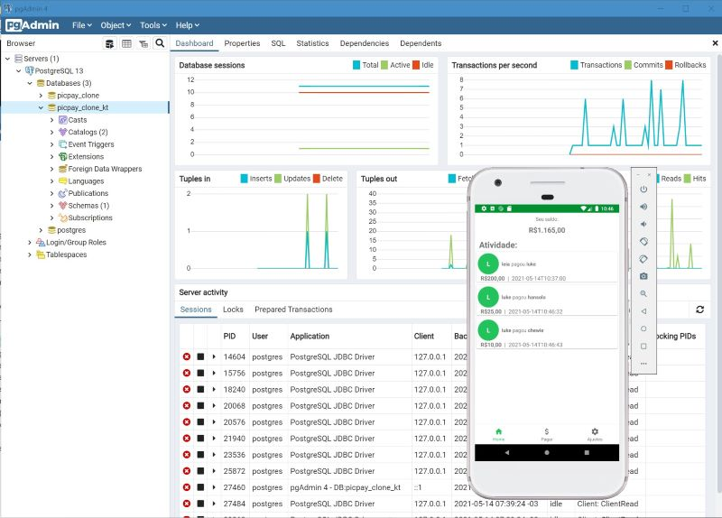

# PicPayClone-Kt v2 by Chico Rasia

Clone da API RestFull PicPay desenvolvida em Kotlin empregando as seguintes tecnologias:

- 100% Kotlin
- Springboot
- Spring data JDBC  
- Jpa e Hibernate
- PostgreSQL
- Database H2 para testes
- Organizado conforme princípios de Clean Architecture

****

:green_heart: everis Kotlin Bootcamp Digital Innovation One 2021

**** 

:computer: http://chicorialabs.com.br